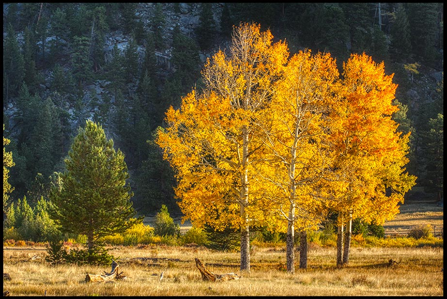
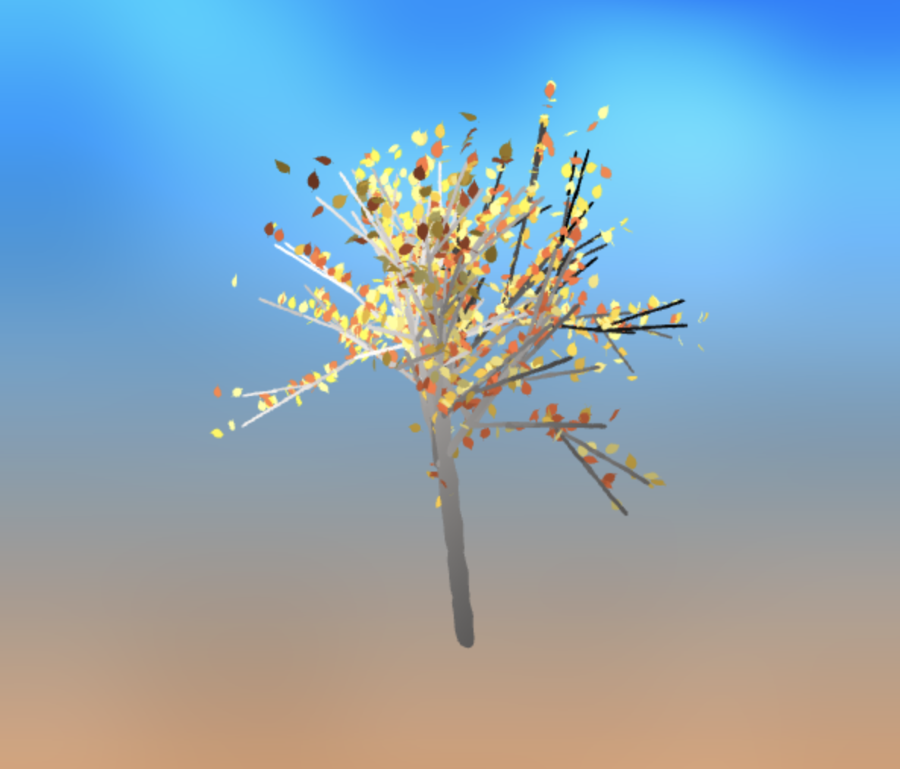

# hw04-l-systems

Emma Holthouser
PennKey: Emma20
https://emmaholthouser16.github.io/hw04-l-systems/

Resources: These are various lsystem websites and articles I looked at for inspiration
https://gpfault.net/posts/generating-trees.txt.html
http://algorithmicbotany.org/papers/abop/abop-ch1.pdf
http://paulbourke.net/fractals/lsys/

https://developer.mozilla.org/en-US/docs/Web/JavaScript/Reference/Global_Objects/Math/random
https://imagecolorpicker.com/

I was inspired by my favorite kind of tree the Aspen. I knew that I wanted a longer tree trunk before the branches grew and branches with lots of color autumn leaves.

[

 
This is a version of my final tree. I used randomness but in the tree grammar and in the drawing rules. In my tree grammar my symbol B had two post conditions depending on the value of a random number generated. It was either   . I also used randomness when determining the angle each branch should rotate, the step each branch took, the distance of each leaf along the branch, and the rotation of each leaf along the branch. I also use a random value to determine which color to pick for each leaf out of a set of yellows and oranges. I really liked that with instanced rendering every leaf could be a different color. I drew inspiration from my grammar both from examples in the articles I looked at and the Houdini L system node. I also spent a lot of time starin at trees and pictures of aspens.Although I like how my tree turned out it does not resemble an aspen as much as I initally wished it to. For the background I wanted to invoke feelings of an autumn sunset with my shades of orange and blye and I used fbm noise to create a cloud like affect over the blue of the sky. 

For the branch model I used a model I had created in Maya and I did the same for the leaf as well. I wanted to leaf shape to be similar to that of an aspen tree. I also start the camera looking up into the tree because I thought that was a really dramatic and somewhat unexpected camera angle. 

The user can control the number of interations of the lsystem, the minimum and maximum possibilites for the random value for each branch rotation and the level of leaf amount. I have a load scene button that needs to be pressed after a change to the other controls in order to update the lsystem and redraw the tree. 

[
