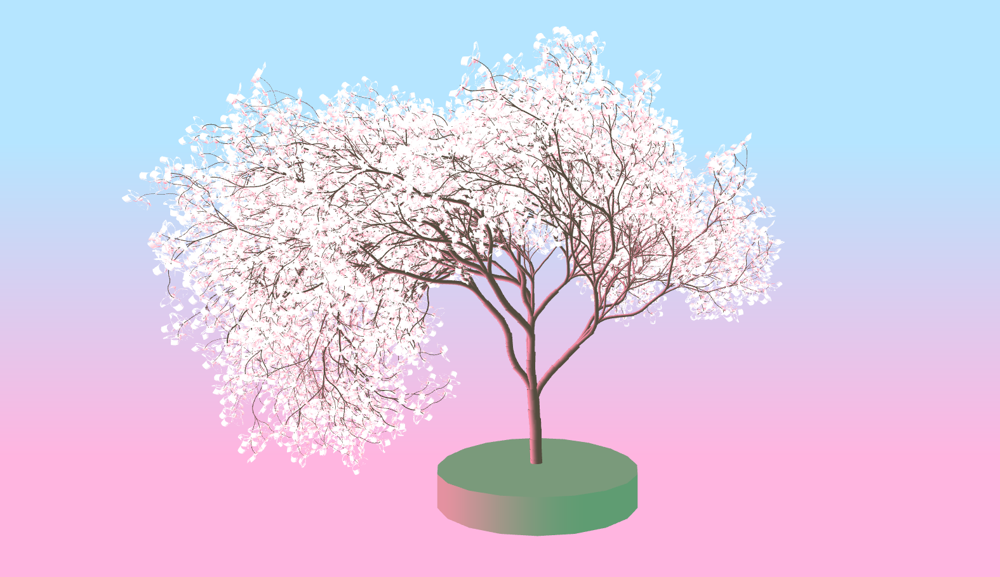
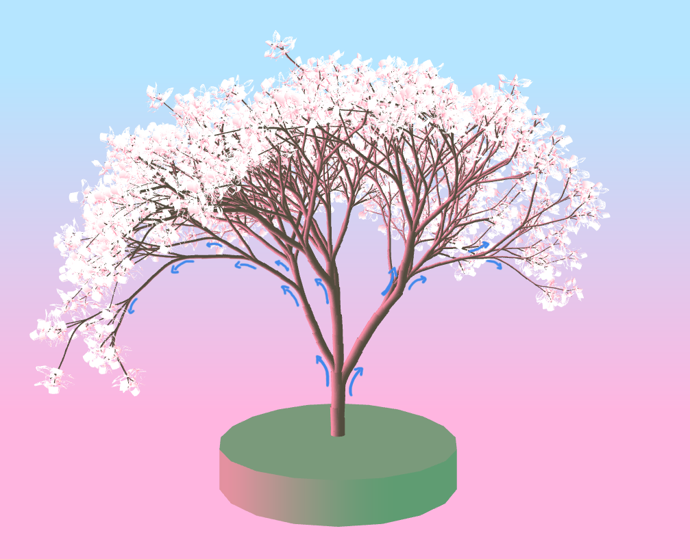
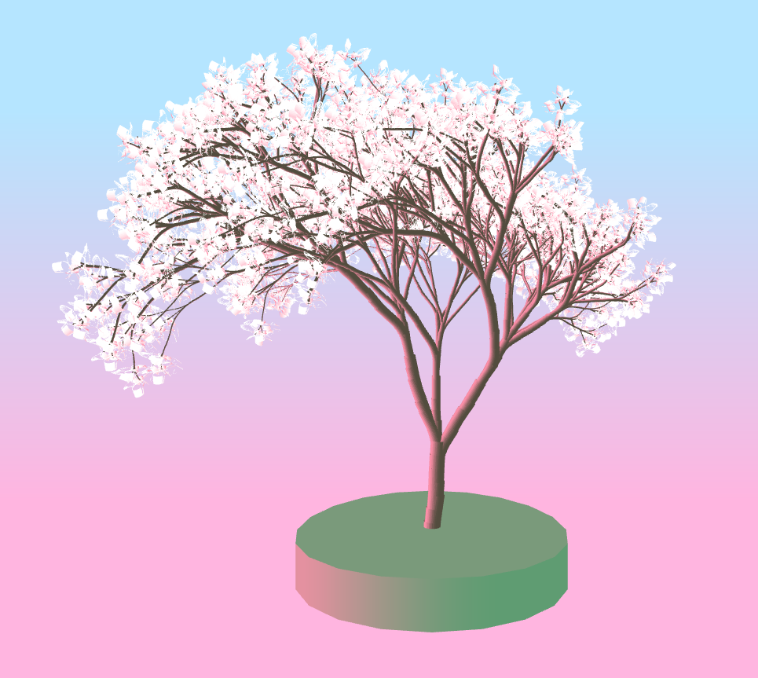
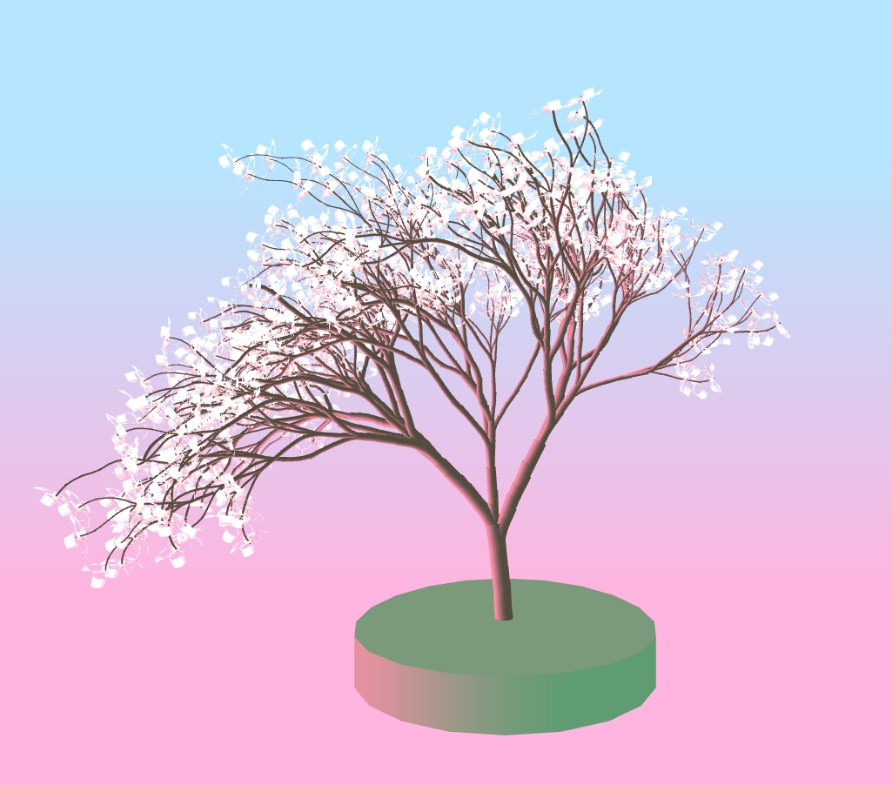
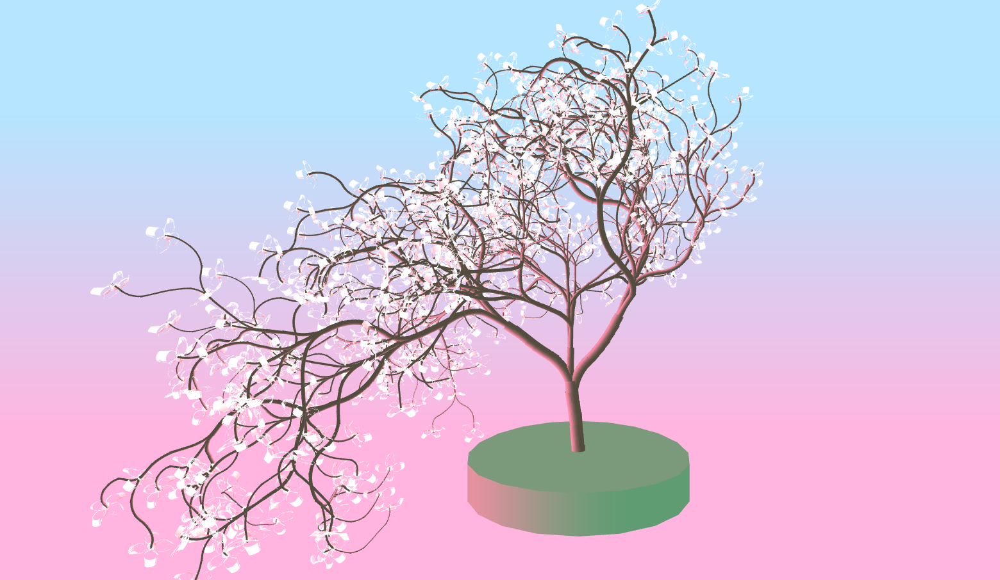
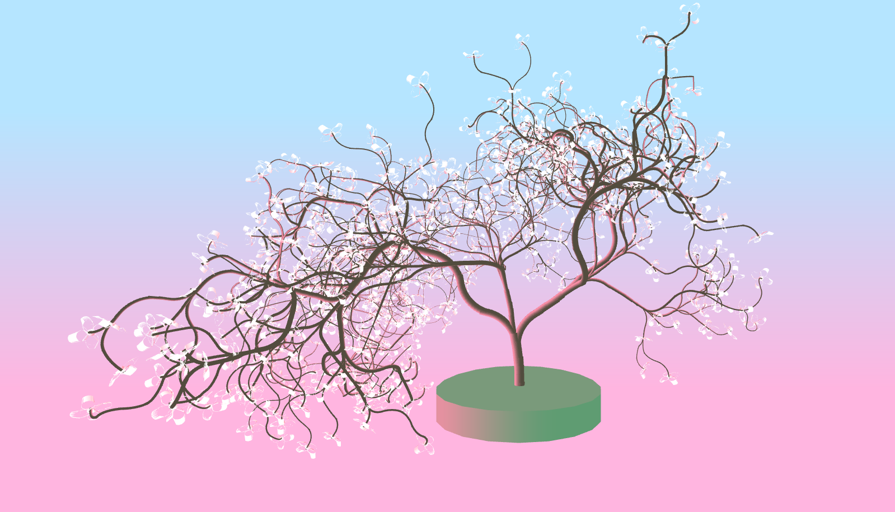
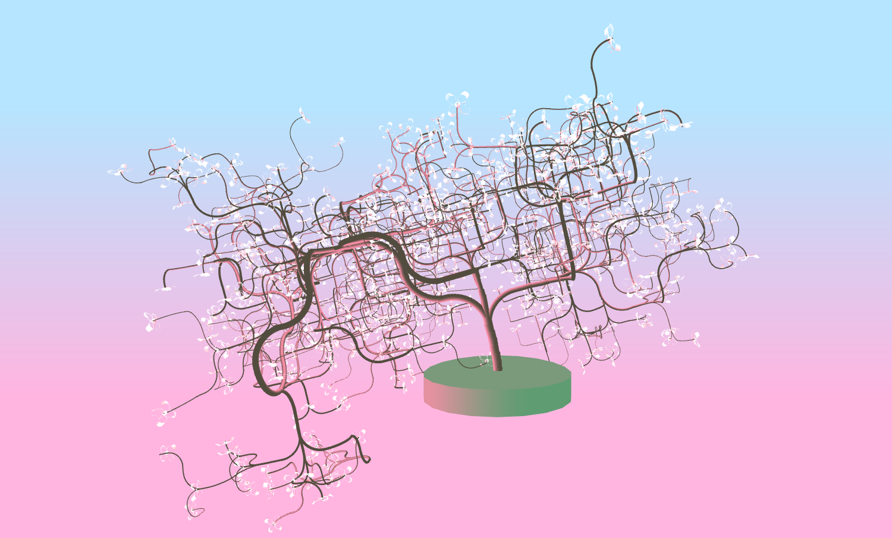
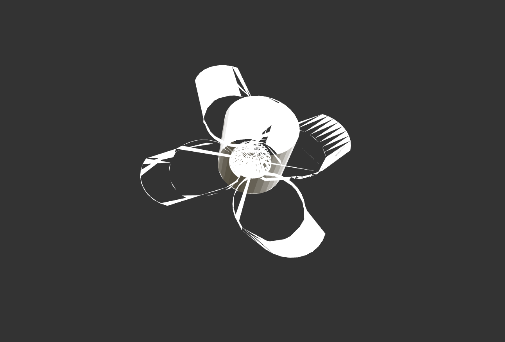
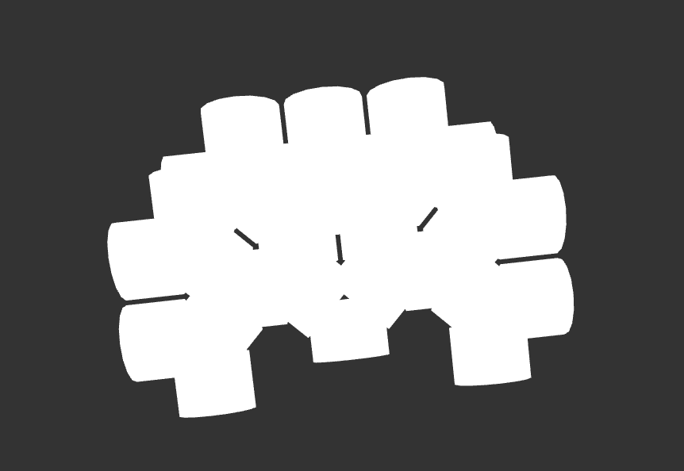

# LSystem Tree

Description
===========
The goal of this project was to get practice creating LSystems with WebGL and Typescript. I aimed to create a tree that looked organic, incorporating randomness to select the expansion and drawing rules. 

Demo: https://asalexan.github.io/hw04-l-systems/

Drawing Natural Curves
======================
I noticed that if I simply rotated a branch offshoot, it looked stiff and inorganic. So, I followed these steps to ensure that the transition between parent branch and offshoot was natural:

1. For `rotationAmt / 5` iterations...
2. Turn 5 degrees around specified axis
3. Move forward some fraction of the `moveAmount`
4. Repeat until `rotateAmt` reached
5. If there is a remainder, rotate the turtle by the remainder amount

This means that, even for trees for which I don't inject curve in the branches (i.e. when curvedBranchProbability = 0), there is still some natural curve. 

Adding Curved Branches
======================
I created a few different expansion rules that would curve branches in different ways. The curves occur as described above, but the expansion rules often dictate multiple turns, which result in wavy branches. One side effect of the curve method I use is that branches with more curves are often longer. Therefore, as the curvedBranchProbability increases, you're likely to see more variation in the lengths of branchs. I have included some comparisons below.

| curvedBranchProbability = 0 | curvedBranchProbability = 0 |
| --------------------------- | --------------------------- |
|  |  |

| curvedBranchProbability = 0.2 | curvedBranchProbability = 0.2 |
| --------------------------- | --------------------------- |
|  |  |

How Changing the Angle Affects the Output
=========================================
I wanted to keep in mind that realistic trees aren't constructed entirely randomly -- there still exists a certain symmetry. So, I decided to choose my axis of rotation in an alternating manner. On odd iterations, the turtle would rotate about the z-axis, while on even iterations, the turtle would rotate about the x-axis. This structure was also beneficial to ensure I didn't generate any sideways trees -- the first branches are always guaranteed to branch out to the sides of the trunk, giving the camera a better view. I achieved this alternating structure by replacing my rotation symbols during the grammer expansion, where the iteration of the grammar expansion determined the symbols. 

I also wanted to demonstrate how changing the angle changes the effect, especially as it draws attention to the difference my curve code makes.

*Angle: 53*

*Angle: 65*

*Angle: 90*

Bloopers
========

### Half the Geometry on Vacation

I discovered that this obj loading issue was actually a Blender export problem after successfully importing an obj exported from Maya. However, I decided I liked the effect and kept the semi-present flowers.

### You're a Tree? Stop Lion to Me

One of my first trees I constructed before figuring out how to build an attractive tree. You will notice he looks like a lion with his mane.
