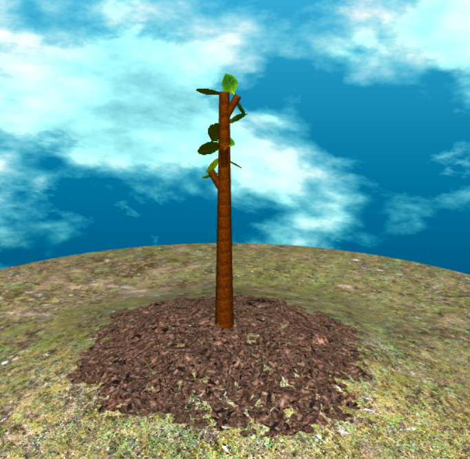
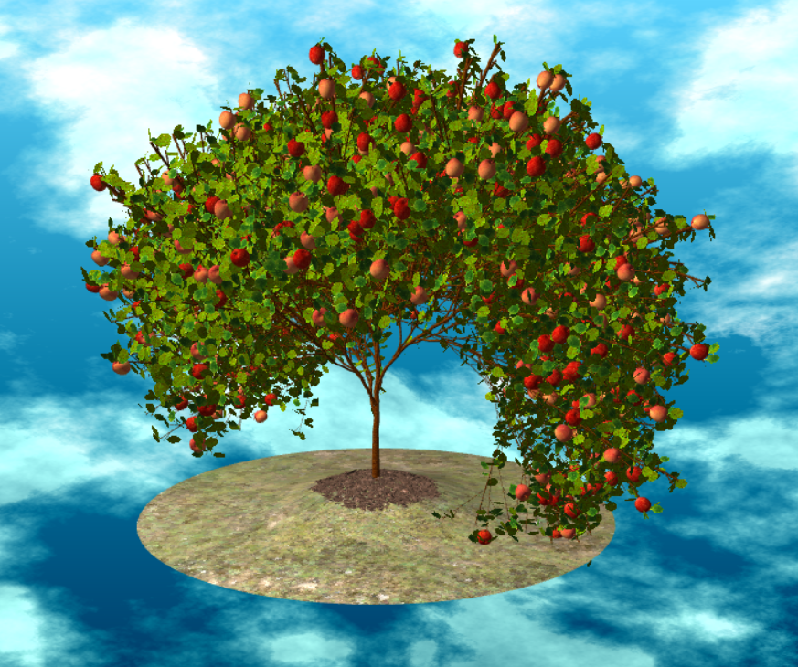
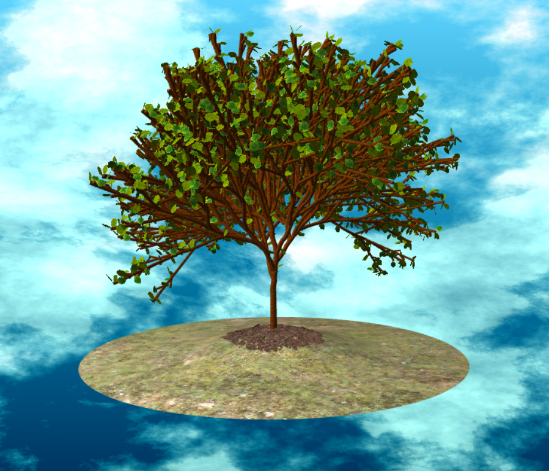
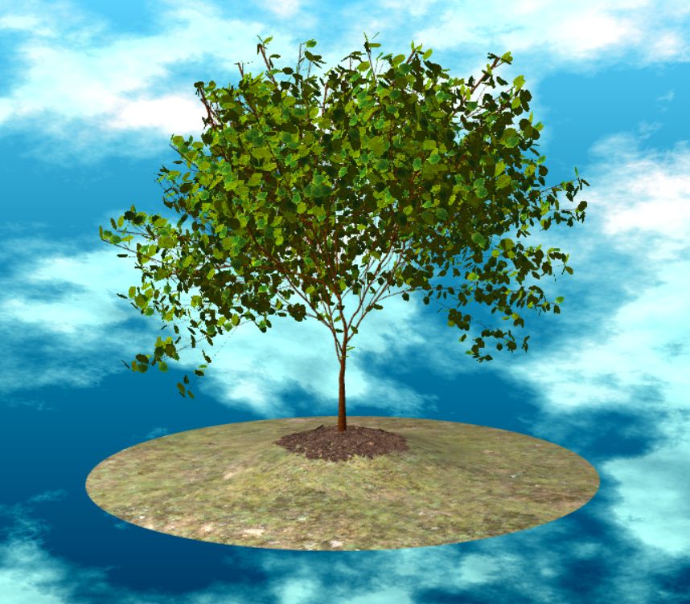
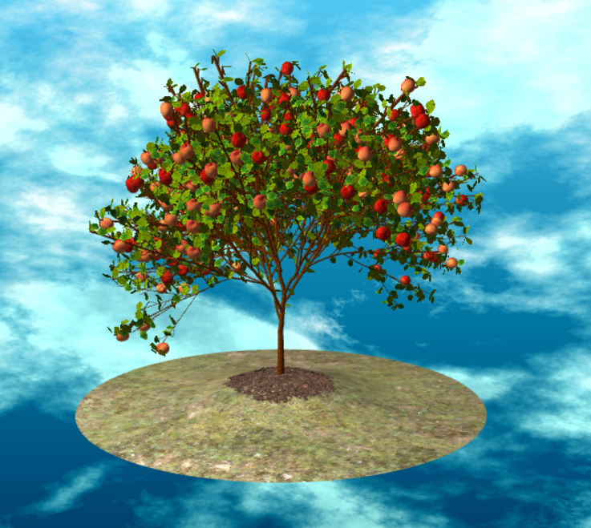
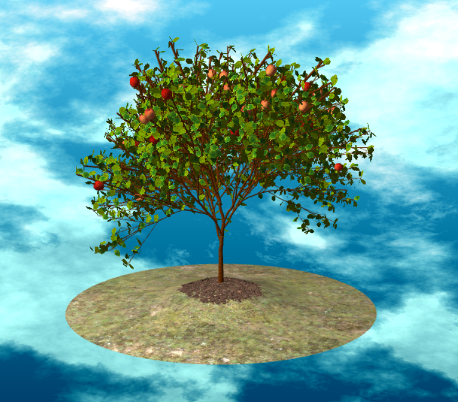

# Procedural Apple Tree
Name : Samantha Lee
PennKey : smlee18

Live Demo: https://18smlee.github.io/hw04-l-systems/
Currently not working :(

## Apple Tree Lsystem Design
I started with a base rule of F = F[-F]F[+F], and slowly added in elements of variance to get a more visually interesting tree. To get the branches rotating in all directions I added a few additional recursive calls rotating around the right and up vectors. I also added a rotateRandom function into the drawing rules that generates a random angle based on a seed input and rotates a branch that amount about a given axis. This gave the trunk and branches a more organic, "wobbly" effect rather than staying stick straight. 

I also tapered the branches based on two different depth values. The first depth value counts how deep in the recursion we are, corresponding to the height of the tree. The second depth value counts how many times we move forward in a given recursive layer. Then I based the scale of the cylinder instances on both values to taper the tree from bottom to top as a whole as well as for each individual branch.

The orientation of the leaves on the tree are generated by Math.random(), which means they are different every time we reload the scene. I added some apples as well for a bit of variation and fun! All of the 3D models including the pot, ground, apples, and leaves I modeled in Maya and loaded them into the scene as OBJs.

## Procedural Controls
I wanted to add in a way to visualize the tree grow. This can be represented by the number of iterations we perform the recursion, which the user can specify. 

The user can also increase or decrease the radius of the tree as well as the seed that generates the rotation angles for each branch. 

The user can control the density of apples in the tree by increasing or decreasing the apple density. 

## Final Touches
I also implemented textures by loading in images and using UV coordinates to project them on to the meshes. I uploaded 2 different textures for both apples and leaves and set a probility to a random value to increase variation. Additionally I added fbm clouds to background's flat shader to add a bit more detail to the overall image.

## Resources
https://synesenom.github.io/ran/
I used this library to generate a seeded random number in order to generate the same number every time the function is called.
