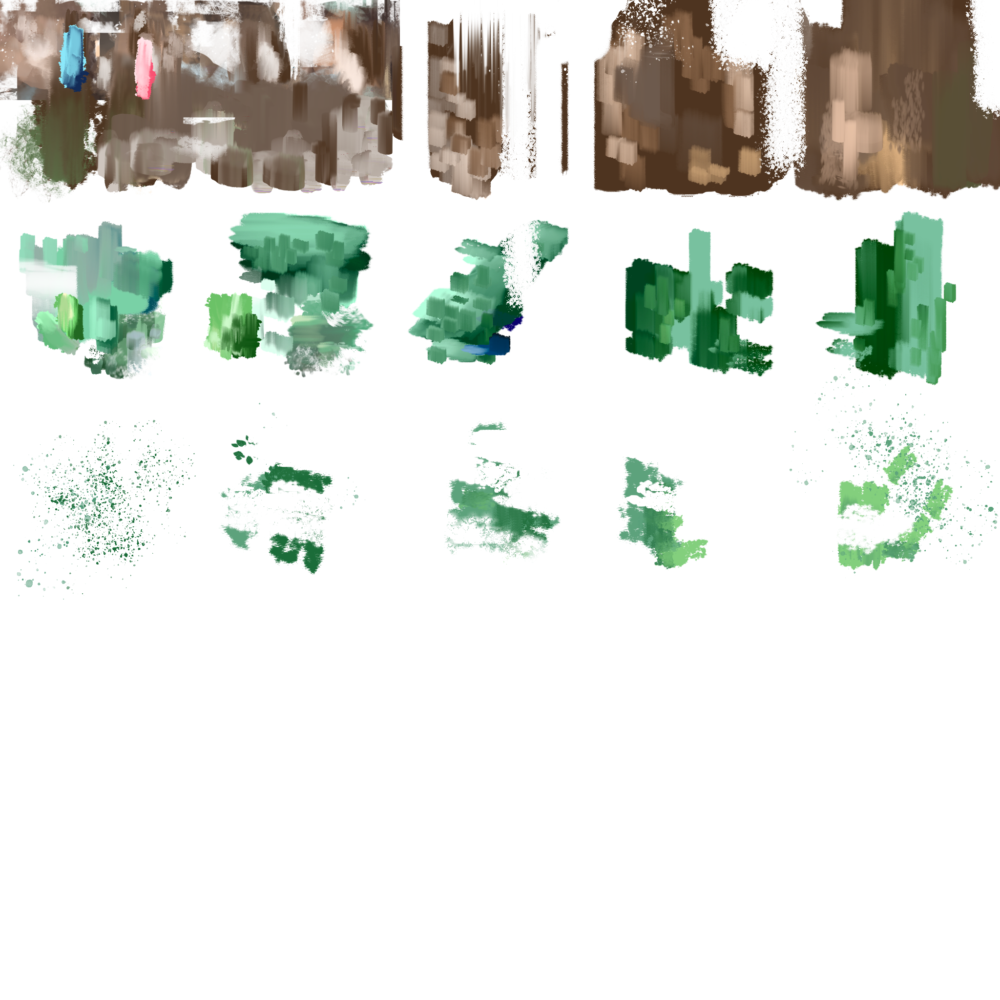

# Homework 4: L-systems

For this assignment, I wanted to experiment with stylized rendering along with the base L-System requirements.

 __Name__: Jake Lem

__PennKey__: jakelem

__Demo Link__: https://jakelem.github.io/hw04-l-systems/

- __L-System__: The turtle is advanced through a roll/pitch/yaw system. The branches reduce in length and radius based on an exponential falloff function of turtle depth. There is randomness applied in turtle rotations.

- __Geometry__: All geometry is instanced based on a cylinder mesh and the given square mesh.

- __Texturing__: All texturing is done with one texture sheet, pictured below. I wanted to create a stylized/painterly effect. There are unused cells in the sheet, and in the future I want to create more sheets/texture variations. Different instances sample different texture cells on the sheet. I also created normal maps, although the overall effect is pretty subtle. I used alpha blending to try and achieve paint-stroke like shapes over the model.

- __Background__: The background is a simple texture sampled painted image with some FBM UV distortion. I also created falling leaves/paint strokes in the background that are instanced and offset/rotated within a vertex shader.

- __User Control__: The user can control the number of iterations, the amount of rotational randomness, the radial and step decay (how much the radius/step falls off with depth), the angle, initial radius, step size, and leaf size of the tree. The generated tree is deterministic, and the user can also generate new trees with the same parameters for different random seeds. The tree does not regenerate automatically, so the user must press "Load Scene" to preview new settings. Different trees with their parameters are pictured below.

## Sources
- Texturing in WebGL: https://developer.mozilla.org/en-US/docs/Web/API/WebGL_API/Tutorial/Using_textures_in_WebGL
